## Ejercicio 1 - Obtención de Datos

>Ir a la fuente de datos fiable de meteorología, la AEMET. Obtener los archivos de datos precip.MIROC5.RCP 60.2006-2100.SDSM_REJ. Antes será necesario solicitar una API-Key a la AEMET para poder acceder a la descarga de los datos.

### Obtención de la API Key

Para obtener la API Key, es necesario acceder a la página oficial de AEMET. Seguidamente, situarse en el apartado de "DATOS ABIERTOS" -> "AEMET OPENDATA", bajar hasta el final de la página y entrar en el enlace de "AEMET OPENDATA". Una vez dentro, elegir la opción de de obtención de API Key "Solicitar". Dentro del formulario, introducir un Email para obtener la clave mediante el correo electrónico.

---
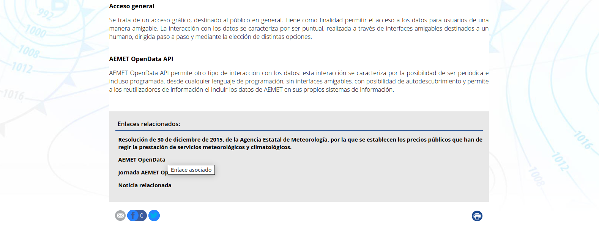
---

---

Una vez tengamos todos el archivo descargado (precip.MIROC5.RCP60.2006-2100.SDSM_REJ.tar.gz), deberemos de descomprimirlo para obtener la carpeta con todos los archivos .dat

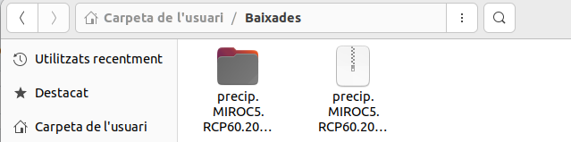

---

## Ejercicio 2 - Organizar y procesar los datos

> PASO 1: Revisar las cabeceras, separación entre datos, comentarios. Saber cómo están delimitados los datos. Qué columnas hay y qué tipos de datos.

Principalmente, se puede ver que las cabeceras están separadas por tabulación (`\t`), dentro de ésta hay diferentes campos, los cuales son:

1. **`precip`**
  - Indica que los datos están relacionados con precipitaciones.

2. **`MIROC5`**
  - Hace referencia al modelo climático utilizado.

3. **`RCP60`**
  - Representa un escenario de emisiones de gases de efecto invernadero.

4. **`REGRESION`**
  - Indica que los datos han sido procesados mediante un modelo de regresión.

5. **`decimas`**
  - Especifica la unidad de medida para los valores de los datos.

6. **`1`**
  - Podría ser un identificador o una versión del conjunto de datos.

Los datos en las líneas dentro de los archivos están delimitados por espacios. Por ejemplo:

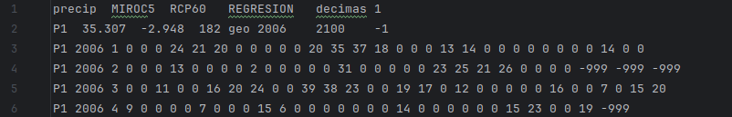

  - Una etiqueta del punto de observación (P1) es la estación. También es conocido como "Punto de Observación"
  - Año. (2006-2100).
  - Mes (1-12).
  - Fechas diarias, valores de precipitaciones, seguidas por valores de control como -999 que no existen datos válidos o disponibles.

> PASO 2: Verificar que todos los archivos tienen el mismo formato. Se puede hacer un script de validación básica, que lea las primeras filas de cada archivo y determinaar el número de columnas y delimitadores.

> PASO 3: Asegurar que los datos no contengan errores, valores que falten o inconsistencias:
Lectura: Utilizar pandas para gestionar los archivos y gestionar errores de lectura.
Verifica la consistencia de las columnas: Asegurar que los datos en cada columna tienen el tipo esperado (numérico, fecha, etc.).
Gestionar valores que faltan o corruptos: Identifica y trata datos nulos o valores atípicos.

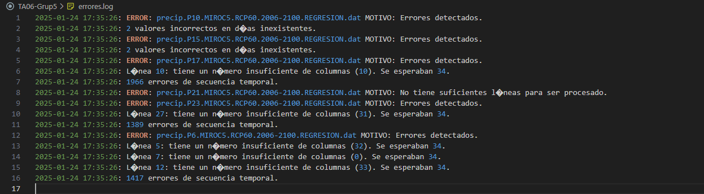

Se ha hecho algunas pruebas, por ejemplo: 
- eEl número de columnas y filas
- Introducir fechas incorrectas. (El año sólo puede ser des del 2006-2100, un año sólo puede tener 12 meses ...)
- Introducir valores no numéricos donde no toca

> PASO 4: Documenta todo el proceso por si tienes que repetirlo alguna vez. Indica qué decisiones has tomado, qué has hecho con los valores nulos y cómo has solucionado inconsistencias.

· Calcular el porcentaje de datos carentes (-999)

· Calcular estadísticas: de los datos procesados.

· Medios y totales anuales: Muestra la precipitación total y media por año.

· Tendencia de cambio: La tasa de variación anual de las precipitaciones.

· Extremos: Los años más lluviosos y más secos.

· Analizar los datos: pensar qué estadísticas tiene sentido hacer. Y añadir por lo menos dos más.

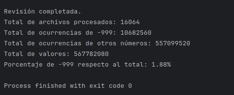

Al ejecutar el código desarrollado para analizar los archivos según los parámetros indicados en el enunciado, se han obtenido los resultados que se muestran en la imagen adjunta. Este código ha permitido identificar:

- El total de archivos procesados, que asciende a 16.064.

- El número total de ocurrencias del valor -999, que representa los datos faltantes o especiales, con un total de 10.682.560 ocurrencias.

- El total de otros valores presentes en los archivos, que suma 557.019.200 ocurrencias.

- El porcentaje de valores -999 respecto al total de datos, que en este caso es del 1,88%

- El total de valores: 567.701.760

_LA MEDIA ANUAL:_ 

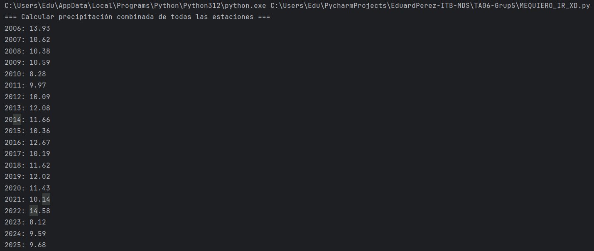

_TOTAL ANUAL:_

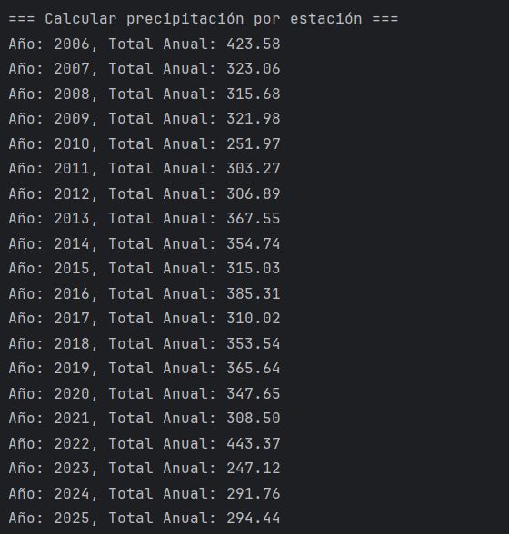

- El año más lluvioso ha sido el 2022

- El año más seco es el 2027

Se podría incluir algunas estadísticas como: el promedio de precipitación por mes, promedio de precipitaciones por estación del año (primavera, verano, otoño,invierno) o los años con precipitación mayor a un umbral específico. 

Procesos realizados en cada etapa del trabajo:

1. Obtención de datos 

Lo primero que hicimos fue acceder a la plataforma oficial de la AEMET mediante una API Key donde pudimos encontrar y decargar un archivo comprimido que contenia los datos meteorológicos del año 2006-2100; el archivo (precip.MIROC5.RCP60.2006-2100.SDSM_REJ.tar.gz). Al descomprimir la carpeta, obtuvimos 16.064 archivos .dat, cada archivo, era una estación diferente de la AEMET, es decir, había 16.064 estaciones que recogian información de las precipitaciones desde los años 2006-2100.

2.  Organizar y procesar los datos
Realizamos una análisis del archivo .dat para poder entender la estructura, los tipos de datos que hay y obtenemos estas conclusiones:
- Los datos estaban organizados en columnas separadas por tabulaciones.
- Identificador de la estación (P1, P2, etc.).
- Año y mes de los datos (2006 1, 2006 2, 2006 3, etc.).
- Valores de precipitación para cada día del mes, expresados en décimas de milímetro.
- Valores faltantes: -999, los cuales indican datos no disponibles.

3. Hicimos un script que leía los archivos y determinaba el número de columnas, filas, delimitadores, valores nulos y cantidad de datos procesados.
4.  

## Ejercicio 3 - Generar Resultados

> - Mostrar resúmenes estadísticos por pantalla
> - Mostrar gráficos estadísticos por pantalla
> - Exportar los resúmenes estadísticos a archivos CSV

#### PRECIPITACIÓN MEDIA ANUAL

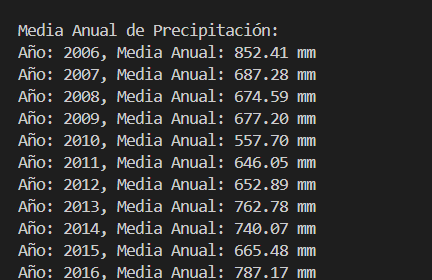

#### PRECIPITACIÓN TOTAL ANUAL

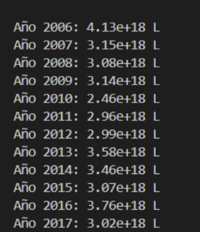
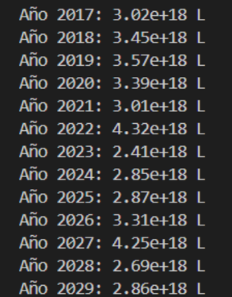

#### TASA DE VARIACIÓN ANUAL

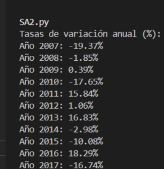
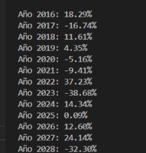

#### GRÁFICO DE MEDIA ANUAL DE PRECIPITACIÓN
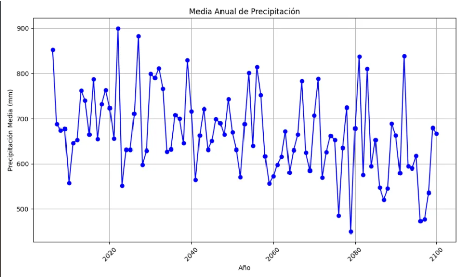

#### GRÁFICO DE PRECIPITACIÓN TOTAL EN ESPAÑA 
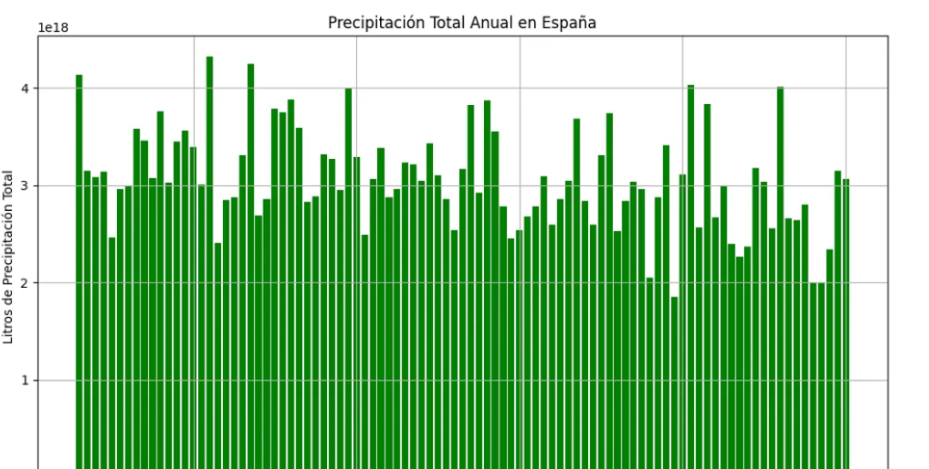

#### TASA DE VARIACIÓN ANUAL DE PRECIPITACIÓN
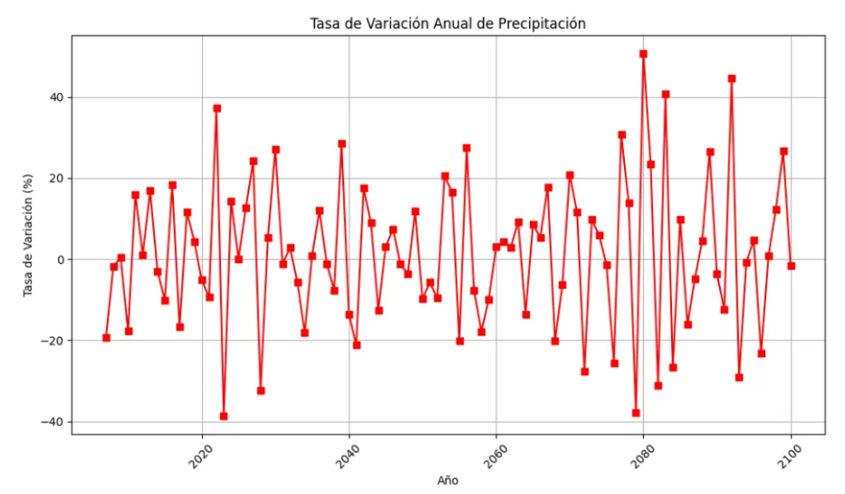

#### RESUMEN ESTADÍSTICO CSV
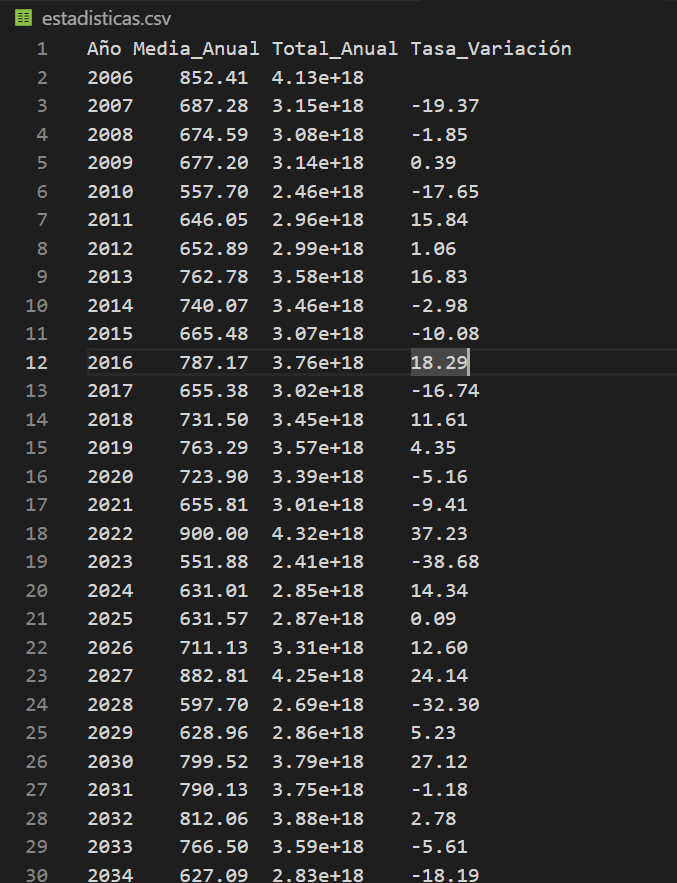

## Ejercicio 4 - Publicar los Datos

### Publicación de los Datos  

En este apartado, hemos desarrollado una web que presenta los datos generados por la aplicación en un **URL público**, permitiendo su consulta de manera sencilla e intuitiva.  

#### Contenido de la Web  
📌 **Resúmenes estadísticos** de las precipitaciones analizadas.  
📌 **Gráficos representativos** para visualizar tendencias y patrones.  

#### Estructura de la Web  
✅ Archivos **HTML y CSS** separados.  
✅ Recursos como **imágenes y datos** organizados en directorios específicos.  

🔗 **Accede a la web aquí:** [https://alejandroarbos-itb2425.github.io/TA06-Grup5/E04/index.html]

## Ejercicio 5 - Reflexión y Conclusión del Proyecto 

En este proyecto hemos trabajado con diferentes lenguajes de programación y tipos de archivos. En la primera fase, recopilamos los datos oficiales de la AEMET sobre todos los días en los que ha llovido y la cantidad de litros por metro cuadrado desde el año 2006 hasta 2100.

Uno de los principales desafíos fue el manejo de una gran cantidad de archivos, en concreto, más de 16.000. Esto complicó el desarrollo, ya que ejecutar un programa para contar los archivos y calcular promedios implicaba un tiempo de procesamiento elevado. 

En el Ejercicio 2, donde se nos pedía organizar y procesar estos datos, optimizamos el código reduciendo el número de archivos en nuestras pruebas iniciales. Tras verificar que el programa funcionaba correctamente con un subconjunto de datos, procedimos a ejecutarlo con el total de archivos, logrando finalmente un procesamiento eficiente.

En el Ejercicio 3, generamos gráficos representativos de los datos obtenidos. Uno de los mayores retos fue desarrollar un código que, además de calcular los valores requeridos para los gráficos, generará automáticamente archivos CSV con la información procesada.

Finalmente, en el ejercicio 4, creamos una página web utilizando HTML y CSS para publicar los datos y los análisis obtenidos. La web incluye diferentes secciones: una presentación del equipo, un área de descarga con los archivos de datos generados, y un apartado con gráficos y estadísticas basadas en la información extraída de la AEMET.

Gracias a este proyecto, hemos adquirido experiencia en la gestión y análisis de grandes volúmenes de datos, así como en la optimización de código y la publicación de información en un entorno web.

#### REGISTRE D'APRENENTATGE

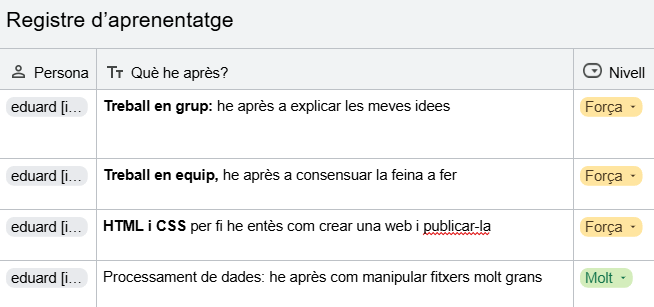
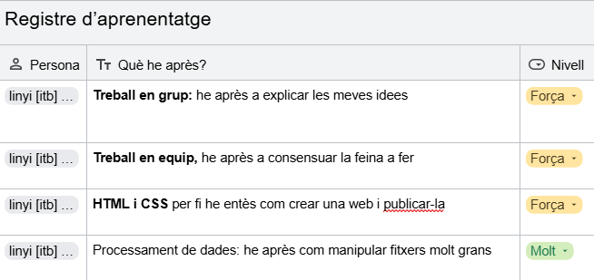
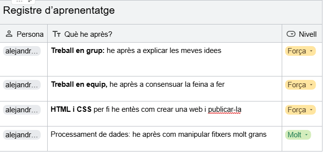
